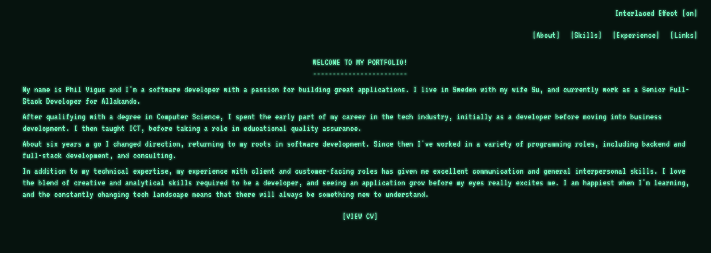

# Professional Portfolio



My professional portfolio.

## Technologies used

| Purpose  | Technology                    |
|----------|-------------------------------|
| Language | JavaScript                    |
| Frontend | React, Nextjs                 |
| Linting  | Eslint, Prettier              |
| Testing  | Vitest, React Testing Library |
| CI/CD    | Github, Netlify               |

## Getting started

```bash
# clone the repository to your local machine
git clone git@github.com:PhilipVigus/portfolio-next.git

# install the dependencies
npm install
# or
yarn install 
```

## Running the project

```bash
# start the development server
netlify dev
```

## Running the tests

```bash
# run the tests
npm test
```

## Design and approach

I wanted to create a simple, clean and professional portfolio so decided to use Nextjs, as it is a framework I am
familiar and I knew it would quickly allow me to produce a simple static site. I used the template provided by
[netlify](https://docs.netlify.com/frameworks/next-js/overview/), which made it easy to set up CI/CD.

I wanted to create a retro-inspired site, and the design is based on ideas
from [this blog post](https://webartisan.info/how-i-made-my-80s-retro-style-homepage-part-1#heading-ascii-art). I made
the interlacing effect toggleable, as I was concerned it could make the site difficult to read for some people.

I used Tailwind CSS for styling as it has been a while since I used it and wanted to see what had been added.

